# Simulador de Memoria Virtual com Paginacao

**Disciplina:** Analise e Aplicacao de Sistemas Operacionais  
**Universidade:** Universidade do Vale do Rio dos Sinos (UNISINOS)  
---

## Descricao

Simulador de gerenciamento de memoria virtual com paginacao, implementado em Python.

O sistema simula uma **MMU (Memory Management Unit)** que:
- Traduz enderecos virtuais para fisicos
- Detecta e trata **faltas de pagina** (page faults)
- Gerencia carregamento e substituicao de paginas com algoritmo **LRU**
- Executa com **2 processos leves (threads)** acessando memoria simultaneamente

---

## Especificacoes do Sistema Ficticio

| Componente                | Valor                        |
|---------------------------|------------------------------|
| Memoria Principal (RAM)   | 64 KB                        |
| Memoria Virtual           | 1 MB                         |
| Tamanho de Pagina / Frame | 8 KB                         |
| Numero de Frames          | 8  (64 KB / 8 KB)            |
| Numero de Paginas Virtuais| 128 (1 MB / 8 KB)            |
| Algoritmo de Substituicao | LRU (Least Recently Used)    |
| Processos Leves           | 2 threads (PID 1 e PID 2)    |

---

## Arquitetura do Simulador

```
simulador.py
|
+-- MemoriaPrincipal   -- RAM fisica com 8 frames de 8 KB (thread-safe)
+-- MemoriaVirtual     -- Espaco virtual de 1 MB por processo (128 paginas)
+-- TabelaDePaginas    -- Mapeamento pagina virtual -> frame fisico (por processo)
+-- MMU                -- Traducao de enderecos, page fault, LRU
+-- ProcessoLeve       -- Thread que gera acessos a enderecos virtuais
```

---

## Fluxo da MMU

```
+------------------+
|    PROCESSO      |
+--------+---------+
         |
         v  Endereco Virtual
+--------+---------+
|       MMU        |
| - Consulta tab.  |
| - Traduz end.    |
+--------+---------+
         |
   Pagina presente?
   /             \
  SIM            NAO
   |              |
   v              v
Endereco      FALTA DE PAGINA
Fisico        /             \
   |    Frame livre?       Sem frame livre
   |         |                    |
   |         v                    v
   |    Carrega pagina     Substituicao LRU
   |    no frame livre     (remove vitima,
   |                        carrega pagina)
   |              \         /
   |               v       v
   |         Atualiza tabela de paginas
   |                   |
   +-------------------+
              |
              v
       Apresenta conteudo
       (dado no endereco)
```

---

## Algoritmo de Substituicao: LRU

O **LRU (Least Recently Used)** substitui a pagina que foi acessada ha mais tempo.

**Implementacao:** usa um `OrderedDict` onde cada chave e `(pid, num_pagina)`.  
- Todo acesso move a entrada para o **fim** da fila  
- A **vitima** e sempre o **primeiro** elemento (o menos recentemente usado)

```
Fila LRU (mais antigo -> mais recente):
  [pag0, pag1, pag2, pag3]

Acesso a pag1 -> move para o fim:
  [pag0, pag2, pag3, pag1]

Memoria cheia + novo acesso -> remove pag0 (vitima):
  [pag2, pag3, pag1, pag_nova]
```

---

## Enderecamento Virtual

Com paginas de 8 KB (8192 bytes = 2^13):

```
Endereco Virtual (20 bits para 1 MB = 2^20):
  +-------------------+-------------------+
  |  bits [19 .. 13]  |  bits [12 ..  0]  |
  |  num. da pagina   |      offset       |
  |   (7 bits = 128)  |  (13 bits = 8192) |
  +-------------------+-------------------+

Exemplo: endereco virtual 0x00002200
  pagina = 0x00002200 / 8192 = pagina 1
  offset = 0x00002200 % 8192 = 512 bytes
```

---

## Como Executar

### Pre-requisitos

```bash
pip install rich
```

### Execucao (Windows)

```bash
python -X utf8 simulador.py
```

### Execucao (Linux / macOS)

```bash
python simulador.py
```

### Modos de Execucao

```
1 - Demo automatica (sequencial)   : sequencia predefinida demonstrando todos os cenarios
1 - Demo automatica (concorrente)  : sequencia predefinida demonstrando todos os cenarios com threads
2 - Interativo        : voce digita PIDs e enderecos virtuais manualmente
```

### Comandos do Modo Interativo

| Entrada        | Descricao                                          |
|----------------|----------------------------------------------------|
| `1` ou `2`     | Seleciona o PID do processo                        |
| `0x00002000`   | Endereco virtual em hexadecimal                    |
| `8192`         | Endereco virtual em decimal                        |
| `frames`       | Exibe estado atual dos frames (memoria principal)  |
| `tabela`       | Exibe tabelas de paginas dos processos             |
| `sair`         | Encerra o simulador                                |

---

### Execução

A execução abaixo demonstra o **Modo Demo Sequencial** (opção 1), que percorre 4 cenários didáticos passo a passo.

---

#### Cenário 1 — Page Fault com Frame Livre

O PID 1 acessa três endereços virtuais pela primeira vez. Como as páginas ainda não estão na memória principal, cada acesso gera um **PAGE FAULT** e o sistema carrega a página em um frame livre.

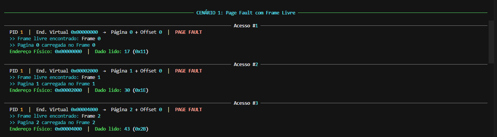

Ao final do cenário, 3 dos 8 frames estão ocupados pelo PID 1 e os outros 5 permanecem livres:

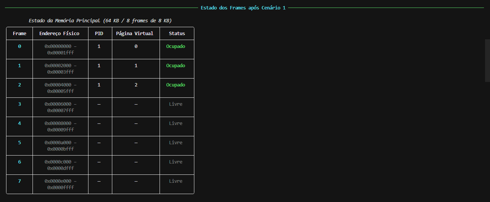

---

#### Cenário 2 — HIT

O PID 1 acessa novamente a Página 0, mas com um offset diferente (offset 100 = `0x64`). Como a página já está carregada no Frame 0, o acesso resulta em **HIT** sem page fault, sem carregamento. A MMU traduz diretamente o endereço virtual para físico.

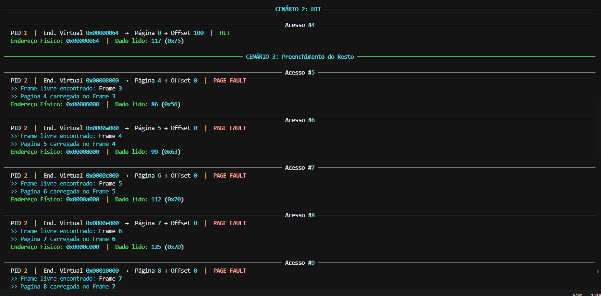

---

#### Cenário 3 — Preenchimento do Resto

O PID 2 entra em cena e acessa 5 novas páginas, preenchendo os 5 frames restantes. Ao final, todos os 8 frames estão ocupados 3 pelo PID 1 e 5 pelo PID 2:

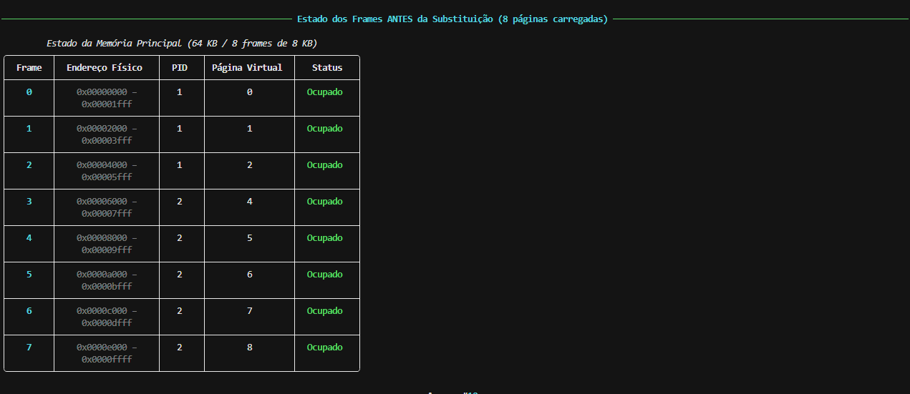

---

#### Cenário 4 — Substituição LRU

Com a memória cheia, qualquer novo acesso a uma página ausente exige **substituição**. O algoritmo LRU escolhe como vítima a página menos recentemente utilizada. Nos acessos #10 e #11, a Página 1 do PID 1 (Frame 1) e a Página 2 do PID 1 (Frame 2) são substituídas pelas novas páginas solicitadas:

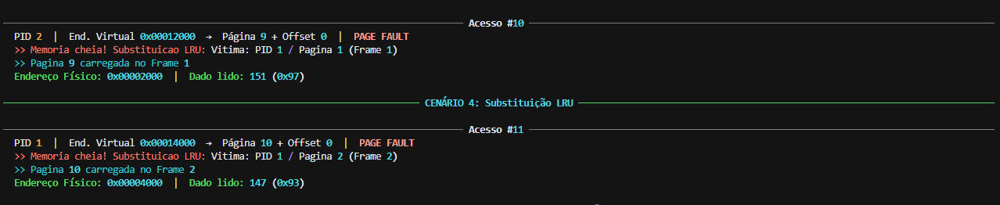

Estado final da memória após as substituições os frames 1 e 2 agora pertencem a páginas diferentes:

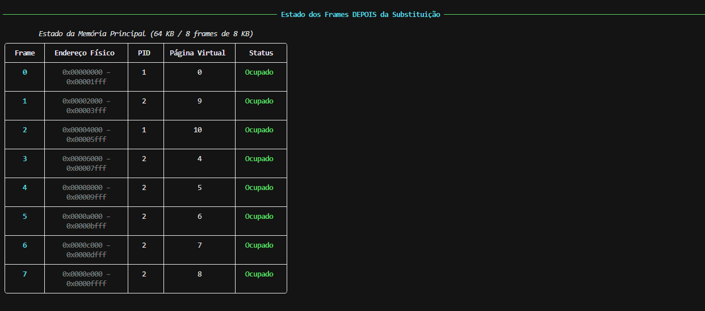

---

### Demo Automática — Concorrência entre Processos (Opção 2)

A demo automática executa dois processos leves (**threads**) ao mesmo tempo, competindo pelos mesmos 8 frames da memória física. A ordem dos acessos é intercalada entre PID 1 e PID 2, demonstrando concorrência real com uso de lock para evitar conflitos.

#### Fase 1 — Page Faults com frames livres (acessos #1 a #7)

Os dois processos iniciam simultaneamente. Os acessos se alternam entre PID 1 e PID 2, cada um carregando suas páginas nos frames livres disponíveis:

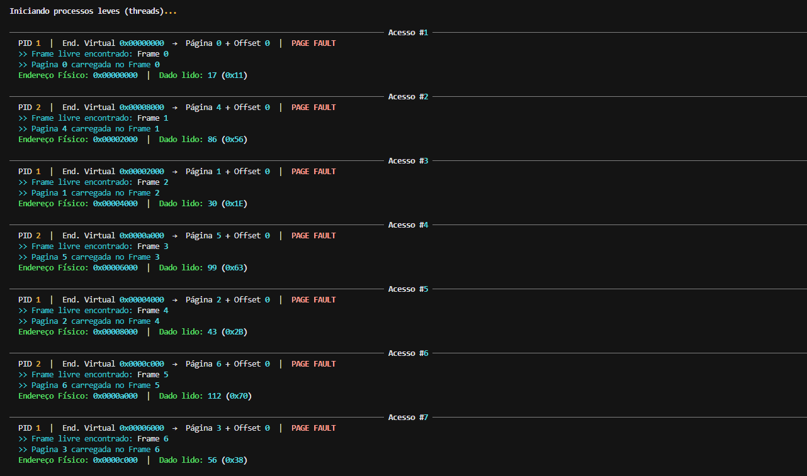

#### Fase 2 — HITs e início das substituições LRU (acessos #8 a #14)

Após todos os frames serem preenchidos (acesso #8), os acessos #9 e #10 resultam em **HIT** para cada processo. A partir do acesso #11, a memória está cheia e cada novo acesso passa a acionar o **algoritmo LRU** os processos competem pelos frames e podem substituir páginas um do outro:

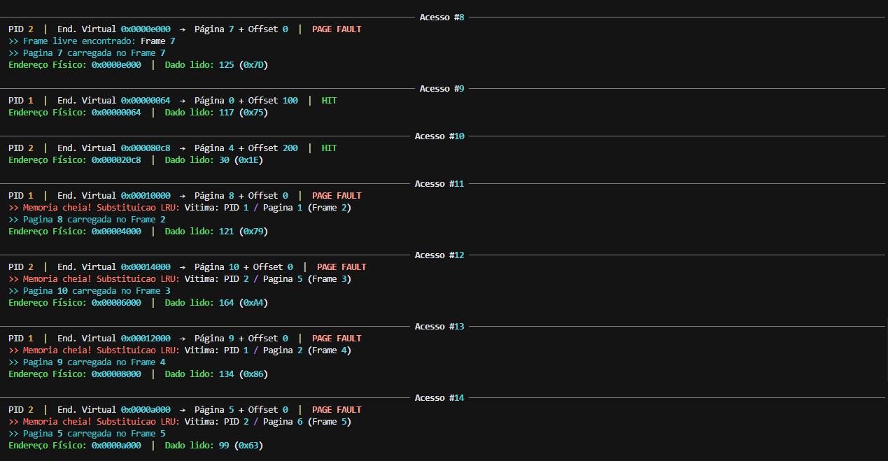

#### Fase 3 — Última substituição e estado final (acesso #15)

O acesso #15 do PID 1 substitui sua própria Página 3 (Frame 6) pela Página 1. Ao final, os 8 frames estão ocupados com páginas dos dois processos misturadas:

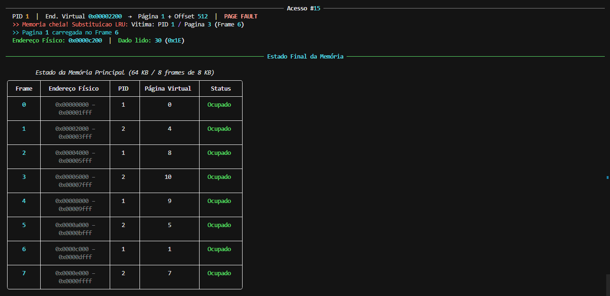

#### Tabelas de Páginas ao final da execução

Cada processo mantém sua própria tabela de páginas, com mapeamento independente de página virtual para frame físico:

**PID 1** — páginas 0, 1, 8 e 9 presentes na RAM:

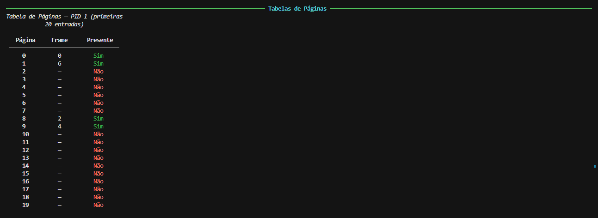

**PID 2** — páginas 4, 5, 7 e 10 presentes na RAM:

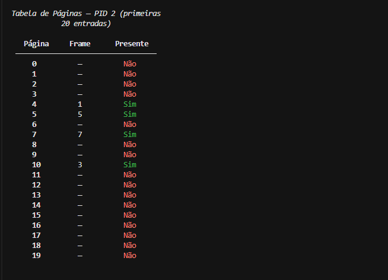

---

## Dependencias

- Python 3.10+
- [rich](https://github.com/Textualize/rich) — formatacao visual no terminal
